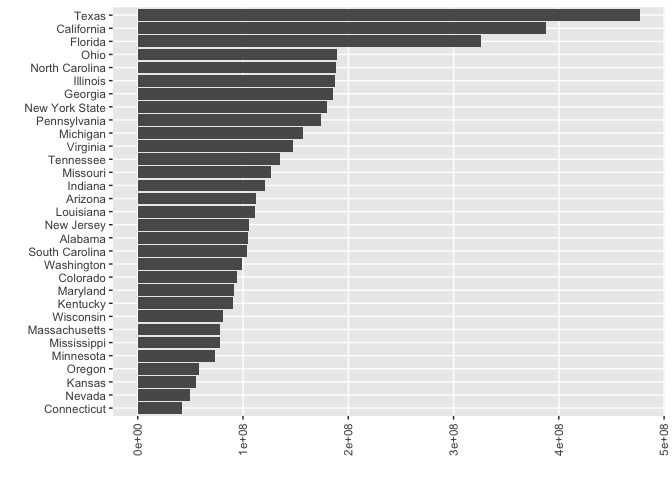

Data Cleaning and Analysis
================

## Required Packages

``` r
library(tidyverse)
```

    ## ── Attaching packages ─────────────────────────────────────── tidyverse 1.3.2 ──
    ## ✔ ggplot2 3.4.1      ✔ purrr   0.3.4 
    ## ✔ tibble  3.1.8      ✔ dplyr   1.0.10
    ## ✔ tidyr   1.2.1      ✔ stringr 1.4.1 
    ## ✔ readr   2.1.2      ✔ forcats 0.5.2 
    ## ── Conflicts ────────────────────────────────────────── tidyverse_conflicts() ──
    ## ✖ dplyr::filter() masks stats::filter()
    ## ✖ dplyr::lag()    masks stats::lag()

## Data Loading

``` r
read_csv("/Users/kenjinchang/github/seasonality-of-us-meat-consumption/data/st_proc_mn_wtfix_abb.csv.gz") %>%
  select(-...1) %>%
  head(5)
```

    ## New names:
    ## Rows: 2796805 Columns: 11
    ## ── Column specification
    ## ──────────────────────────────────────────────────────── Delimiter: "," chr
    ## (3): state, concatenated, region dbl (7): ...1, yr, mn,
    ## conv_factor_to_units_kg, unit_price_kg, units_kg, re... date (1): date
    ## ℹ Use `spec()` to retrieve the full column specification for this data. ℹ
    ## Specify the column types or set `show_col_types = FALSE` to quiet this message.
    ## • `` -> `...1`

    ## # A tibble: 5 × 10
    ##   date          yr    mn state   conv_f…¹ unit_…² conca…³ units…⁴ region regio…⁵
    ##   <date>     <dbl> <dbl> <chr>      <dbl>   <dbl> <chr>     <dbl> <chr>    <dbl>
    ## 1 2017-01-28  2017     1 Alabama    0.340    5.65 PROCES…  15230. south     1.05
    ## 2 2017-02-25  2017     2 Alabama    0.340    5.90 PROCES…  12711. south     1.05
    ## 3 2017-03-25  2017     3 Alabama    0.340    5.83 PROCES…  13712. south     1.05
    ## 4 2017-04-22  2017     4 Alabama    0.340    5.74 PROCES…  14436. south     1.05
    ## 5 2017-05-20  2017     5 Alabama    0.340    5.63 PROCES…  14063. south     1.04
    ## # … with abbreviated variable names ¹​conv_factor_to_units_kg, ²​unit_price_kg,
    ## #   ³​concatenated, ⁴​units_kg, ⁵​region_dec2019dollars

## Total Volume (kg) of Processed Meat Sales by State

``` r
read_csv("/Users/kenjinchang/github/seasonality-of-us-meat-consumption/data/st_proc_mn_wtfix_abb.csv.gz") %>%
  select(-...1) %>%
  group_by(state) %>%
  summarize(total_kg=sum(units_kg,na.rm=TRUE)) %>% 
  ggplot(aes(x=total_kg,y=reorder(state,total_kg))) + 
  geom_col() + 
  xlab("") + 
  ylab("") +
  theme(axis.text.x=element_text(angle=90,vjust=0.5,hjust=1),panel.grid.minor=element_blank())
```

    ## New names:
    ## Rows: 2796805 Columns: 11
    ## ── Column specification
    ## ──────────────────────────────────────────────────────── Delimiter: "," chr
    ## (3): state, concatenated, region dbl (7): ...1, yr, mn,
    ## conv_factor_to_units_kg, unit_price_kg, units_kg, re... date (1): date
    ## ℹ Use `spec()` to retrieve the full column specification for this data. ℹ
    ## Specify the column types or set `show_col_types = FALSE` to quiet this message.
    ## • `` -> `...1`

<!-- -->

## Mean Volume (kg) of Processed Meat Sales by State

``` r
read_csv("/Users/kenjinchang/github/seasonality-of-us-meat-consumption/data/st_proc_mn_wtfix_abb.csv.gz") %>%
  select(-...1) %>%
  group_by(state) %>%
  summarize(mean_kg=mean(units_kg,na.rm=TRUE)) %>% 
  ggplot(aes(x=mean_kg,y=reorder(state,mean_kg))) + 
  geom_col() + 
  xlab("") + 
  ylab("") +
  theme(axis.text.x=element_text(angle=90,vjust=0.5,hjust=1),panel.grid.minor=element_blank())
```

    ## New names:
    ## Rows: 2796805 Columns: 11
    ## ── Column specification
    ## ──────────────────────────────────────────────────────── Delimiter: "," chr
    ## (3): state, concatenated, region dbl (7): ...1, yr, mn,
    ## conv_factor_to_units_kg, unit_price_kg, units_kg, re... date (1): date
    ## ℹ Use `spec()` to retrieve the full column specification for this data. ℹ
    ## Specify the column types or set `show_col_types = FALSE` to quiet this message.
    ## • `` -> `...1`

<!-- -->

## Total Volume (kg) of Processed Meat Sales by Month

``` r
read_csv("/Users/kenjinchang/github/seasonality-of-us-meat-consumption/data/st_proc_mn_wtfix_abb.csv.gz") %>%
  select(-...1) %>%
  group_by(mn) %>%
  summarize(total_kg=sum(units_kg,na.rm=TRUE)) %>% 
  ggplot(aes(x=mn,y=total_kg)) + 
  geom_col() + 
  scale_x_continuous(breaks=c(1:12)) +
  xlab("") + 
  ylab("") +
  theme(panel.grid.minor=element_blank())
```

    ## New names:
    ## Rows: 2796805 Columns: 11
    ## ── Column specification
    ## ──────────────────────────────────────────────────────── Delimiter: "," chr
    ## (3): state, concatenated, region dbl (7): ...1, yr, mn,
    ## conv_factor_to_units_kg, unit_price_kg, units_kg, re... date (1): date
    ## ℹ Use `spec()` to retrieve the full column specification for this data. ℹ
    ## Specify the column types or set `show_col_types = FALSE` to quiet this message.
    ## • `` -> `...1`

<!-- -->

``` r
read_csv("/Users/kenjinchang/github/seasonality-of-us-meat-consumption/data/st_proc_mn_wtfix_abb.csv.gz") %>%
  select(-...1) %>%
  group_by(mn) %>%
  summarize(mean_kg=mean(units_kg,na.rm=TRUE)) %>% 
  ggplot(aes(x=mn,y=mean_kg)) + 
  geom_col() + 
  scale_x_continuous(breaks=c(1:12)) +
  xlab("") + 
  ylab("") +
  theme(panel.grid.minor=element_blank())
```

    ## New names:
    ## Rows: 2796805 Columns: 11
    ## ── Column specification
    ## ──────────────────────────────────────────────────────── Delimiter: "," chr
    ## (3): state, concatenated, region dbl (7): ...1, yr, mn,
    ## conv_factor_to_units_kg, unit_price_kg, units_kg, re... date (1): date
    ## ℹ Use `spec()` to retrieve the full column specification for this data. ℹ
    ## Specify the column types or set `show_col_types = FALSE` to quiet this message.
    ## • `` -> `...1`

<!-- -->
