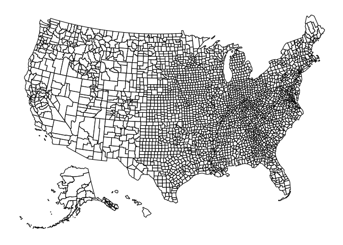
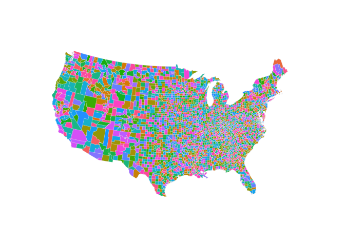

Data Cleaning and Analysis
================

## Required Packages

``` r
library(tidyverse)
```

    ## ── Attaching packages ─────────────────────────────────────── tidyverse 1.3.2 ──
    ## ✔ ggplot2 3.4.1      ✔ purrr   0.3.4 
    ## ✔ tibble  3.1.8      ✔ dplyr   1.0.10
    ## ✔ tidyr   1.2.1      ✔ stringr 1.4.1 
    ## ✔ readr   2.1.2      ✔ forcats 0.5.2 
    ## ── Conflicts ────────────────────────────────────────── tidyverse_conflicts() ──
    ## ✖ dplyr::filter() masks stats::filter()
    ## ✖ dplyr::lag()    masks stats::lag()

``` r
library(usmap)
library(maps)
```

    ## 
    ## Attaching package: 'maps'
    ## 
    ## The following object is masked from 'package:purrr':
    ## 
    ##     map

``` r
library(socviz)
```

## Data Loading

### Retail Data

``` r
read_csv("/Users/kenjinchang/github/seasonality-of-us-meat-consumption/data/st_proc_mn_wtfix_abb.csv.gz") %>%
  select(-...1) %>%
  head(5)
```

    ## New names:
    ## Rows: 2796805 Columns: 11
    ## ── Column specification
    ## ──────────────────────────────────────────────────────── Delimiter: "," chr
    ## (3): state, concatenated, region dbl (7): ...1, yr, mn,
    ## conv_factor_to_units_kg, unit_price_kg, units_kg, re... date (1): date
    ## ℹ Use `spec()` to retrieve the full column specification for this data. ℹ
    ## Specify the column types or set `show_col_types = FALSE` to quiet this message.
    ## • `` -> `...1`

    ## # A tibble: 5 × 10
    ##   date          yr    mn state   conv_f…¹ unit_…² conca…³ units…⁴ region regio…⁵
    ##   <date>     <dbl> <dbl> <chr>      <dbl>   <dbl> <chr>     <dbl> <chr>    <dbl>
    ## 1 2017-01-28  2017     1 Alabama    0.340    5.65 PROCES…  15230. south     1.05
    ## 2 2017-02-25  2017     2 Alabama    0.340    5.90 PROCES…  12711. south     1.05
    ## 3 2017-03-25  2017     3 Alabama    0.340    5.83 PROCES…  13712. south     1.05
    ## 4 2017-04-22  2017     4 Alabama    0.340    5.74 PROCES…  14436. south     1.05
    ## 5 2017-05-20  2017     5 Alabama    0.340    5.63 PROCES…  14063. south     1.04
    ## # … with abbreviated variable names ¹​conv_factor_to_units_kg, ²​unit_price_kg,
    ## #   ³​concatenated, ⁴​units_kg, ⁵​region_dec2019dollars

### Agricultural Subsidy Data

``` r
read_csv("/Users/kenjinchang/github/seasonality-of-us-meat-consumption/data/county_data.csv") %>%
  head(5)
```

    ## Rows: 2305 Columns: 5
    ## ── Column specification ────────────────────────────────────────────────────────
    ## Delimiter: ","
    ## chr (5): county, total_subsidies_1995_2021, perc_state_total, state_abb, state
    ## 
    ## ℹ Use `spec()` to retrieve the full column specification for this data.
    ## ℹ Specify the column types or set `show_col_types = FALSE` to quiet this message.

    ## # A tibble: 5 × 5
    ##   county                total_subsidies_1995_2021 perc_state_total state…¹ state
    ##   <chr>                 <chr>                     <chr>            <chr>   <chr>
    ## 1 Gaines County, Texas  $1,476,802,523            3.30%            TX      Texas
    ## 2 Hale County, Texas    $1,159,637,316            2.60%            TX      Texas
    ## 3 Dawson County, Texas  $1,110,737,641            2.50%            TX      Texas
    ## 4 Terry County, Texas   $987,748,081              2.20%            TX      Texas
    ## 5 Wharton County, Texas $954,867,910              2.10%            TX      Texas
    ## # … with abbreviated variable name ¹​state_abb

Shapefile Data

``` r
map_data("county") %>%
  head(6)
```

    ##        long      lat group order  region subregion
    ## 1 -86.50517 32.34920     1     1 alabama   autauga
    ## 2 -86.53382 32.35493     1     2 alabama   autauga
    ## 3 -86.54527 32.36639     1     3 alabama   autauga
    ## 4 -86.55673 32.37785     1     4 alabama   autauga
    ## 5 -86.57966 32.38357     1     5 alabama   autauga
    ## 6 -86.59111 32.37785     1     6 alabama   autauga

## Total Volume (kg) of Processed Meat Sales by State

``` r
read_csv("/Users/kenjinchang/github/seasonality-of-us-meat-consumption/data/st_proc_mn_wtfix_abb.csv.gz") %>%
  select(-...1) %>%
  group_by(state) %>%
  summarize(total_kg=sum(units_kg,na.rm=TRUE)) %>% 
  ggplot(aes(x=total_kg,y=reorder(state,total_kg))) + 
  geom_col() + 
  xlab("") + 
  ylab("") +
  theme(axis.text.x=element_text(angle=90,vjust=0.5,hjust=1),panel.grid.minor=element_blank())
```

    ## New names:
    ## Rows: 2796805 Columns: 11
    ## ── Column specification
    ## ──────────────────────────────────────────────────────── Delimiter: "," chr
    ## (3): state, concatenated, region dbl (7): ...1, yr, mn,
    ## conv_factor_to_units_kg, unit_price_kg, units_kg, re... date (1): date
    ## ℹ Use `spec()` to retrieve the full column specification for this data. ℹ
    ## Specify the column types or set `show_col_types = FALSE` to quiet this message.
    ## • `` -> `...1`

<!-- -->

## Mean Volume (kg) of Processed Meat Sales by State

``` r
read_csv("/Users/kenjinchang/github/seasonality-of-us-meat-consumption/data/st_proc_mn_wtfix_abb.csv.gz") %>%
  select(-...1) %>%
  group_by(state) %>%
  summarize(mean_kg=mean(units_kg,na.rm=TRUE)) %>% 
  ggplot(aes(x=mean_kg,y=reorder(state,mean_kg))) + 
  geom_col() + 
  xlab("") + 
  ylab("") +
  theme(axis.text.x=element_text(angle=90,vjust=0.5,hjust=1),panel.grid.minor=element_blank())
```

    ## New names:
    ## Rows: 2796805 Columns: 11
    ## ── Column specification
    ## ──────────────────────────────────────────────────────── Delimiter: "," chr
    ## (3): state, concatenated, region dbl (7): ...1, yr, mn,
    ## conv_factor_to_units_kg, unit_price_kg, units_kg, re... date (1): date
    ## ℹ Use `spec()` to retrieve the full column specification for this data. ℹ
    ## Specify the column types or set `show_col_types = FALSE` to quiet this message.
    ## • `` -> `...1`

<!-- -->

## Total Volume (kg) of Processed Meat Sales by Month

``` r
read_csv("/Users/kenjinchang/github/seasonality-of-us-meat-consumption/data/st_proc_mn_wtfix_abb.csv.gz") %>%
  select(-...1) %>%
  group_by(mn) %>%
  summarize(total_kg=sum(units_kg,na.rm=TRUE)) %>% 
  ggplot(aes(x=mn,y=total_kg)) + 
  geom_col() + 
  scale_x_continuous(breaks=c(1:12)) +
  xlab("") + 
  ylab("") +
  theme(panel.grid.minor=element_blank())
```

    ## New names:
    ## Rows: 2796805 Columns: 11
    ## ── Column specification
    ## ──────────────────────────────────────────────────────── Delimiter: "," chr
    ## (3): state, concatenated, region dbl (7): ...1, yr, mn,
    ## conv_factor_to_units_kg, unit_price_kg, units_kg, re... date (1): date
    ## ℹ Use `spec()` to retrieve the full column specification for this data. ℹ
    ## Specify the column types or set `show_col_types = FALSE` to quiet this message.
    ## • `` -> `...1`

<!-- -->

``` r
read_csv("/Users/kenjinchang/github/seasonality-of-us-meat-consumption/data/st_proc_mn_wtfix_abb.csv.gz") %>%
  select(-...1) %>%
  group_by(mn) %>%
  summarize(mean_kg=mean(units_kg,na.rm=TRUE)) %>% 
  ggplot(aes(x=mn,y=mean_kg)) + 
  geom_col() + 
  scale_x_continuous(breaks=c(1:12)) +
  xlab("") + 
  ylab("") +
  theme(panel.grid.minor=element_blank())
```

    ## New names:
    ## Rows: 2796805 Columns: 11
    ## ── Column specification
    ## ──────────────────────────────────────────────────────── Delimiter: "," chr
    ## (3): state, concatenated, region dbl (7): ...1, yr, mn,
    ## conv_factor_to_units_kg, unit_price_kg, units_kg, re... date (1): date
    ## ℹ Use `spec()` to retrieve the full column specification for this data. ℹ
    ## Specify the column types or set `show_col_types = FALSE` to quiet this message.
    ## • `` -> `...1`

<!-- -->

## State-Level Agricultural Subsidy Payments (using `usmap` package)

``` r
plot_usmap(regions="counties")
```

<!-- --> \##
State-Level Agricultural Subsidy Payments (using `maps` package)

``` r
us_counties <- map_data("county")
```

``` r
ggplot(us_counties,aes(x=long,y=lat,group=group,fill=subregion)) + 
  geom_polygon(color="gray90",linewidth=0.1) +
  coord_map(projection="albers",lat0=39,lat1=45) +
  guides(fill="none")+
  theme(axis.line=element_blank(),
        axis.text=element_blank(),
        axis.ticks=element_blank(),
        axis.title=element_blank(),
        panel.background=element_blank(),
        panel.border=element_blank(),
        panel.grid=element_blank())
```

<!-- -->
Need to prep data for left_join

left_join(x,y,by=join_by(colname1==colname2))

``` r
read_csv("/Users/kenjinchang/github/seasonality-of-us-meat-consumption/data/county_data.csv") 
```

    ## Rows: 2305 Columns: 5
    ## ── Column specification ────────────────────────────────────────────────────────
    ## Delimiter: ","
    ## chr (5): county, total_subsidies_1995_2021, perc_state_total, state_abb, state
    ## 
    ## ℹ Use `spec()` to retrieve the full column specification for this data.
    ## ℹ Specify the column types or set `show_col_types = FALSE` to quiet this message.

    ## # A tibble: 2,305 × 5
    ##    county                total_subsidies_1995_2021 perc_state_to…¹ state…² state
    ##    <chr>                 <chr>                     <chr>           <chr>   <chr>
    ##  1 Gaines County, Texas  $1,476,802,523            3.30%           TX      Texas
    ##  2 Hale County, Texas    $1,159,637,316            2.60%           TX      Texas
    ##  3 Dawson County, Texas  $1,110,737,641            2.50%           TX      Texas
    ##  4 Terry County, Texas   $987,748,081              2.20%           TX      Texas
    ##  5 Wharton County, Texas $954,867,910              2.10%           TX      Texas
    ##  6 Lamb County, Texas    $928,633,397              2.10%           TX      Texas
    ##  7 Floyd County, Texas   $877,686,118              2.00%           TX      Texas
    ##  8 Lubbock County, Texas $874,170,512              2.00%           TX      Texas
    ##  9 Lynn County, Texas    $830,835,732              1.90%           TX      Texas
    ## 10 Hockley County, Texas $830,765,051              1.90%           TX      Texas
    ## # … with 2,295 more rows, and abbreviated variable names ¹​perc_state_total,
    ## #   ²​state_abb

county_map %\>% ggplot(aes(x=long,y=lat)) + geom_polygon()
