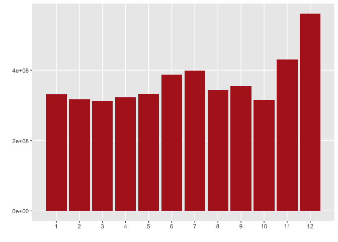
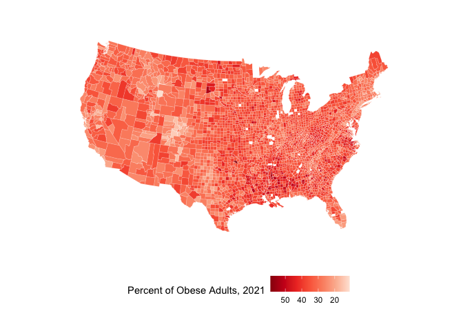

Data Cleaning and Analysis
================

## Required Packages

``` r
library(tidyverse)
```

    ## ── Attaching packages ─────────────────────────────────────── tidyverse 1.3.2 ──
    ## ✔ ggplot2 3.4.1      ✔ purrr   0.3.4 
    ## ✔ tibble  3.1.8      ✔ dplyr   1.0.10
    ## ✔ tidyr   1.2.1      ✔ stringr 1.4.1 
    ## ✔ readr   2.1.2      ✔ forcats 0.5.2 
    ## ── Conflicts ────────────────────────────────────────── tidyverse_conflicts() ──
    ## ✖ dplyr::filter() masks stats::filter()
    ## ✖ dplyr::lag()    masks stats::lag()

``` r
library(scales)
```

    ## 
    ## Attaching package: 'scales'
    ## 
    ## The following object is masked from 'package:purrr':
    ## 
    ##     discard
    ## 
    ## The following object is masked from 'package:readr':
    ## 
    ##     col_factor

library(usmap) library(maps) library(socviz)

## Data Loading

### Retail Data

``` r
read_csv("/Users/kenjinchang/github/seasonality-of-us-meat-consumption/data/st_proc_mn_wtfix_abb.csv.gz") %>%
  select(-...1) %>%
  head(5)
```

    ## New names:
    ## Rows: 2796805 Columns: 11
    ## ── Column specification
    ## ──────────────────────────────────────────────────────── Delimiter: "," chr
    ## (3): state, concatenated, region dbl (7): ...1, yr, mn,
    ## conv_factor_to_units_kg, unit_price_kg, units_kg, re... date (1): date
    ## ℹ Use `spec()` to retrieve the full column specification for this data. ℹ
    ## Specify the column types or set `show_col_types = FALSE` to quiet this message.
    ## • `` -> `...1`

    ## # A tibble: 5 × 10
    ##   date          yr    mn state   conv_f…¹ unit_…² conca…³ units…⁴ region regio…⁵
    ##   <date>     <dbl> <dbl> <chr>      <dbl>   <dbl> <chr>     <dbl> <chr>    <dbl>
    ## 1 2017-01-28  2017     1 Alabama    0.340    5.65 PROCES…  15230. south     1.05
    ## 2 2017-02-25  2017     2 Alabama    0.340    5.90 PROCES…  12711. south     1.05
    ## 3 2017-03-25  2017     3 Alabama    0.340    5.83 PROCES…  13712. south     1.05
    ## 4 2017-04-22  2017     4 Alabama    0.340    5.74 PROCES…  14436. south     1.05
    ## 5 2017-05-20  2017     5 Alabama    0.340    5.63 PROCES…  14063. south     1.04
    ## # … with abbreviated variable names ¹​conv_factor_to_units_kg, ²​unit_price_kg,
    ## #   ³​concatenated, ⁴​units_kg, ⁵​region_dec2019dollars

### Agricultural Subsidy Data

``` r
read_csv("/Users/kenjinchang/github/seasonality-of-us-meat-consumption/data/county_data.csv") %>%
  head(5)
```

    ## Rows: 3055 Columns: 5
    ## ── Column specification ────────────────────────────────────────────────────────
    ## Delimiter: ","
    ## chr (3): county, state_abb, state
    ## dbl (2): total_subsidies_1995_2021, perc_state_total
    ## 
    ## ℹ Use `spec()` to retrieve the full column specification for this data.
    ## ℹ Specify the column types or set `show_col_types = FALSE` to quiet this message.

    ## # A tibble: 5 × 5
    ##   county                total_subsidies_1995_2021 perc_state_total state…¹ state
    ##   <chr>                                     <dbl>            <dbl> <chr>   <chr>
    ## 1 Gaines County, Texas                 1476802523            0.033 TX      Texas
    ## 2 Hale County, Texas                   1159637316            0.026 TX      Texas
    ## 3 Dawson County, Texas                 1110737641            0.025 TX      Texas
    ## 4 Terry County, Texas                   987748081            0.022 TX      Texas
    ## 5 Wharton County, Texas                 954867910            0.021 TX      Texas
    ## # … with abbreviated variable name ¹​state_abb

County Shapefile Data

``` r
map_data("county") %>%
  head(6)
```

    ##        long      lat group order  region subregion
    ## 1 -86.50517 32.34920     1     1 alabama   autauga
    ## 2 -86.53382 32.35493     1     2 alabama   autauga
    ## 3 -86.54527 32.36639     1     3 alabama   autauga
    ## 4 -86.55673 32.37785     1     4 alabama   autauga
    ## 5 -86.57966 32.38357     1     5 alabama   autauga
    ## 6 -86.59111 32.37785     1     6 alabama   autauga

## Total Volume (kg) of Processed Meat Sales by State

``` r
read_csv("/Users/kenjinchang/github/seasonality-of-us-meat-consumption/data/st_proc_mn_wtfix_abb.csv.gz") %>%
  select(-...1) %>%
  group_by(state) %>%
  summarize(total_kg=sum(units_kg,na.rm=TRUE)) %>% 
  ggplot(aes(x=total_kg,y=reorder(state,total_kg))) + 
  geom_col(fill="firebrick") + 
  xlab("") + 
  ylab("") +
  theme(axis.text.x=element_text(angle=90,vjust=0.5,hjust=1),panel.grid.minor=element_blank())
```

    ## New names:
    ## Rows: 2796805 Columns: 11
    ## ── Column specification
    ## ──────────────────────────────────────────────────────── Delimiter: "," chr
    ## (3): state, concatenated, region dbl (7): ...1, yr, mn,
    ## conv_factor_to_units_kg, unit_price_kg, units_kg, re... date (1): date
    ## ℹ Use `spec()` to retrieve the full column specification for this data. ℹ
    ## Specify the column types or set `show_col_types = FALSE` to quiet this message.
    ## • `` -> `...1`

<!-- -->

## Mean Volume (kg) of Processed Meat Sales by State

``` r
read_csv("/Users/kenjinchang/github/seasonality-of-us-meat-consumption/data/st_proc_mn_wtfix_abb.csv.gz") %>%
  select(-...1) %>%
  group_by(state) %>%
  summarize(mean_kg=mean(units_kg,na.rm=TRUE)) %>% 
  ggplot(aes(x=mean_kg,y=reorder(state,mean_kg))) + 
  geom_col(fill="firebrick") + 
  xlab("") + 
  ylab("") +
  theme(axis.text.x=element_text(angle=90,vjust=0.5,hjust=1),panel.grid.minor=element_blank())
```

    ## New names:
    ## Rows: 2796805 Columns: 11
    ## ── Column specification
    ## ──────────────────────────────────────────────────────── Delimiter: "," chr
    ## (3): state, concatenated, region dbl (7): ...1, yr, mn,
    ## conv_factor_to_units_kg, unit_price_kg, units_kg, re... date (1): date
    ## ℹ Use `spec()` to retrieve the full column specification for this data. ℹ
    ## Specify the column types or set `show_col_types = FALSE` to quiet this message.
    ## • `` -> `...1`

<!-- -->

## Total Volume (kg) of Processed Meat Sales by Month

``` r
read_csv("/Users/kenjinchang/github/seasonality-of-us-meat-consumption/data/st_proc_mn_wtfix_abb.csv.gz") %>%
  select(-...1) %>%
  group_by(mn) %>%
  summarize(total_kg=sum(units_kg,na.rm=TRUE)) %>% 
  ggplot(aes(x=mn,y=total_kg)) + 
  geom_col(fill="firebrick") + 
  scale_x_continuous(breaks=c(1:12)) +
  xlab("") + 
  ylab("") +
  theme(panel.grid.minor=element_blank())
```

    ## New names:
    ## Rows: 2796805 Columns: 11
    ## ── Column specification
    ## ──────────────────────────────────────────────────────── Delimiter: "," chr
    ## (3): state, concatenated, region dbl (7): ...1, yr, mn,
    ## conv_factor_to_units_kg, unit_price_kg, units_kg, re... date (1): date
    ## ℹ Use `spec()` to retrieve the full column specification for this data. ℹ
    ## Specify the column types or set `show_col_types = FALSE` to quiet this message.
    ## • `` -> `...1`

<!-- -->

### Mean Sales by Month

``` r
read_csv("/Users/kenjinchang/github/seasonality-of-us-meat-consumption/data/st_proc_mn_wtfix_abb.csv.gz") %>%
  select(-...1) %>%
  group_by(mn) %>%
  summarize(mean_kg=mean(units_kg,na.rm=TRUE)) %>% 
  ggplot(aes(x=mn,y=mean_kg)) + 
  geom_col(fill="firebrick") + 
  scale_x_continuous(breaks=c(1:12)) +
  xlab("") + 
  ylab("") +
  theme(panel.grid.minor=element_blank())
```

    ## New names:
    ## Rows: 2796805 Columns: 11
    ## ── Column specification
    ## ──────────────────────────────────────────────────────── Delimiter: "," chr
    ## (3): state, concatenated, region dbl (7): ...1, yr, mn,
    ## conv_factor_to_units_kg, unit_price_kg, units_kg, re... date (1): date
    ## ℹ Use `spec()` to retrieve the full column specification for this data. ℹ
    ## Specify the column types or set `show_col_types = FALSE` to quiet this message.
    ## • `` -> `...1`

<!-- -->

## State-Level Agricultural Subsidy Payments

``` r
us_counties <- map_data("county")
us_counties %>%
  head(6)
```

    ##        long      lat group order  region subregion
    ## 1 -86.50517 32.34920     1     1 alabama   autauga
    ## 2 -86.53382 32.35493     1     2 alabama   autauga
    ## 3 -86.54527 32.36639     1     3 alabama   autauga
    ## 4 -86.55673 32.37785     1     4 alabama   autauga
    ## 5 -86.57966 32.38357     1     5 alabama   autauga
    ## 6 -86.59111 32.37785     1     6 alabama   autauga

``` r
county_data <- read_csv("/Users/kenjinchang/github/seasonality-of-us-meat-consumption/data/county_data.csv") %>%
  mutate(county_no_state=gsub("(.*),.*","\\1",county)) %>%
  mutate(county_abb=str_remove_all(county_no_state, " County| Parish")) %>%
  mutate(state=tolower(state),county_abb=tolower(county_abb)) %>%
  unite(id,c("state","county_abb"),sep=", ",remove=FALSE) %>%
  select(id,state,county_abb,total_subsidies_1995_2021,perc_state_total) %>%
  mutate(perc_natl_total=perc_state_total/sum(perc_state_total)) %>%
  mutate(total_subsidies_1995_2021_bil=total_subsidies_1995_2021/1000000000)
```

    ## Rows: 3055 Columns: 5
    ## ── Column specification ────────────────────────────────────────────────────────
    ## Delimiter: ","
    ## chr (3): county, state_abb, state
    ## dbl (2): total_subsidies_1995_2021, perc_state_total
    ## 
    ## ℹ Use `spec()` to retrieve the full column specification for this data.
    ## ℹ Specify the column types or set `show_col_types = FALSE` to quiet this message.

``` r
county_data %>%
  head(6)
```

    ## # A tibble: 6 × 7
    ##   id             state county_abb total_subsidies_1995…¹ perc_…² perc_…³ total…⁴
    ##   <chr>          <chr> <chr>                       <dbl>   <dbl>   <dbl>   <dbl>
    ## 1 texas, gaines  texas gaines                 1476802523   0.033 6.96e-4   1.48 
    ## 2 texas, hale    texas hale                   1159637316   0.026 5.49e-4   1.16 
    ## 3 texas, dawson  texas dawson                 1110737641   0.025 5.28e-4   1.11 
    ## 4 texas, terry   texas terry                   987748081   0.022 4.64e-4   0.988
    ## 5 texas, wharton texas wharton                 954867910   0.021 4.43e-4   0.955
    ## 6 texas, lamb    texas lamb                    928633397   0.021 4.43e-4   0.929
    ## # … with abbreviated variable names ¹​total_subsidies_1995_2021,
    ## #   ²​perc_state_total, ³​perc_natl_total, ⁴​total_subsidies_1995_2021_bil

``` r
county_map <- map_data("county") %>%
  unite(id,c("region","subregion"),sep=", ",remove=FALSE)
county_map %>%
  head(6)
```

    ##        long      lat group order               id  region subregion
    ## 1 -86.50517 32.34920     1     1 alabama, autauga alabama   autauga
    ## 2 -86.53382 32.35493     1     2 alabama, autauga alabama   autauga
    ## 3 -86.54527 32.36639     1     3 alabama, autauga alabama   autauga
    ## 4 -86.55673 32.37785     1     4 alabama, autauga alabama   autauga
    ## 5 -86.57966 32.38357     1     5 alabama, autauga alabama   autauga
    ## 6 -86.59111 32.37785     1     6 alabama, autauga alabama   autauga

``` r
county_full <- left_join(county_map,county_data,by="id")
county_full %>%
  head(6)
```

    ##        long      lat group order               id  region subregion   state
    ## 1 -86.50517 32.34920     1     1 alabama, autauga alabama   autauga alabama
    ## 2 -86.53382 32.35493     1     2 alabama, autauga alabama   autauga alabama
    ## 3 -86.54527 32.36639     1     3 alabama, autauga alabama   autauga alabama
    ## 4 -86.55673 32.37785     1     4 alabama, autauga alabama   autauga alabama
    ## 5 -86.57966 32.38357     1     5 alabama, autauga alabama   autauga alabama
    ## 6 -86.59111 32.37785     1     6 alabama, autauga alabama   autauga alabama
    ##   county_abb total_subsidies_1995_2021 perc_state_total perc_natl_total
    ## 1    autauga                  61027557            0.012    0.0002532554
    ## 2    autauga                  61027557            0.012    0.0002532554
    ## 3    autauga                  61027557            0.012    0.0002532554
    ## 4    autauga                  61027557            0.012    0.0002532554
    ## 5    autauga                  61027557            0.012    0.0002532554
    ## 6    autauga                  61027557            0.012    0.0002532554
    ##   total_subsidies_1995_2021_bil
    ## 1                    0.06102756
    ## 2                    0.06102756
    ## 3                    0.06102756
    ## 4                    0.06102756
    ## 5                    0.06102756
    ## 6                    0.06102756

### Total Subsidies Given across Counties, 1995-2021

``` r
ggplot(county_full,aes(x=long,y=lat,fill=total_subsidies_1995_2021_bil,group=group)) + 
  geom_polygon(color="white",linewidth=0.05) +
  coord_map(projection="albers",lat0=39,lat1=45) + 
  scale_fill_distiller(palette="Greens",trans="reverse",na.value="white") +
  labs(fill="Total Agricultural Subsidies Given, 1995-2021") +
  xlab("") + 
  ylab("") +
  theme(legend.position="bottom",panel.grid=element_blank(),panel.background=element_blank(),axis.text=element_blank(),axis.ticks=element_blank())
```

<!-- -->

### Percent of All Agricultural Subsidies Given across Counties, 1995-2021

``` r
ggplot(county_full,aes(x=long,y=lat,fill=perc_natl_total,group=group)) + 
  geom_polygon(color="white",linewidth=0.05) +
  coord_map(projection="albers",lat0=39,lat1=45) + 
  scale_fill_distiller(palette="Greens",trans="reverse",na.value="white",labels=percent) +
  labs(fill="Proportion of Agricultural Subsidies Given, 1995-2021") +
  xlab("") + 
  ylab("") +
  theme(legend.position="bottom",panel.grid=element_blank(),panel.background=element_blank(),axis.text=element_blank(),axis.ticks=element_blank())
```

<!-- -->

### Mean subsidies given by state

``` r
county_data %>%
  group_by(state) %>%
  summarize(mean_subsidies_1995_2021=mean(total_subsidies_1995_2021)) %>%
  ggplot(aes(x=mean_subsidies_1995_2021,y=reorder(state,mean_subsidies_1995_2021))) + 
  geom_col(fill="seagreen")
```

<!-- -->

Total subsidies given by state

``` r
county_data %>%
  group_by(state) %>%
  summarize(state_subsidies_1995_2021=sum(total_subsidies_1995_2021)) %>%
  ggplot(aes(x=state_subsidies_1995_2021,y=reorder(state,state_subsidies_1995_2021))) + 
  geom_col(fill="seagreen")
```

<!-- -->

## State-Level Processed Meat Sales (Per Capita)

### Mean Annual Sales Volume (kg) by State

``` r
read_csv("/Users/kenjinchang/github/seasonality-of-us-meat-consumption/data/st_proc_mn_wtfix_abb.csv.gz") %>%
  select(-...1) %>%
  group_by(state) %>%
  summarize(mean_annual_kg=sum(units_kg,na.rm=TRUE)/3) %>%
  ggplot(aes(x=reorder(state,mean_annual_kg),y=mean_annual_kg)) + 
  geom_col(fill="firebrick") + 
  theme(axis.text.x=element_text(angle=90,vjust=0.5,hjust=1)) 
```

    ## New names:
    ## Rows: 2796805 Columns: 11
    ## ── Column specification
    ## ──────────────────────────────────────────────────────── Delimiter: "," chr
    ## (3): state, concatenated, region dbl (7): ...1, yr, mn,
    ## conv_factor_to_units_kg, unit_price_kg, units_kg, re... date (1): date
    ## ℹ Use `spec()` to retrieve the full column specification for this data. ℹ
    ## Specify the column types or set `show_col_types = FALSE` to quiet this message.
    ## • `` -> `...1`

<!-- -->

### Total Sales Volume (kg) by State by Year

``` r
read_csv("/Users/kenjinchang/github/seasonality-of-us-meat-consumption/data/st_proc_mn_wtfix_abb.csv.gz") %>%
  select(-...1) %>%
  group_by(state,yr) %>%
  summarize(total_kg=sum(units_kg,na.rm=TRUE)) %>%
  mutate(yr=as.character(yr)) %>%
  ggplot(aes(x=total_kg,y=reorder(state,total_kg),fill=yr)) + 
  geom_col(position="dodge") + 
  scale_fill_brewer(palette="Reds")
```

    ## New names:
    ## Rows: 2796805 Columns: 11
    ## ── Column specification
    ## ──────────────────────────────────────────────────────── Delimiter: "," chr
    ## (3): state, concatenated, region dbl (7): ...1, yr, mn,
    ## conv_factor_to_units_kg, unit_price_kg, units_kg, re... date (1): date
    ## ℹ Use `spec()` to retrieve the full column specification for this data. ℹ
    ## Specify the column types or set `show_col_types = FALSE` to quiet this message.
    ## `summarise()` has grouped output by 'state'. You can override using the
    ## `.groups` argument.
    ## • `` -> `...1`

<!-- -->

### Total Sales Volume (kg) by Year

``` r
read_csv("/Users/kenjinchang/github/seasonality-of-us-meat-consumption/data/st_proc_mn_wtfix_abb.csv.gz") %>%
  select(-...1) %>%
  group_by(yr) %>%
  summarize(total_kg=sum(units_kg,na.rm=TRUE)) %>%
  ggplot(aes(x=yr,y=total_kg)) + 
  geom_col(fill="firebrick")
```

    ## New names:
    ## Rows: 2796805 Columns: 11
    ## ── Column specification
    ## ──────────────────────────────────────────────────────── Delimiter: "," chr
    ## (3): state, concatenated, region dbl (7): ...1, yr, mn,
    ## conv_factor_to_units_kg, unit_price_kg, units_kg, re... date (1): date
    ## ℹ Use `spec()` to retrieve the full column specification for this data. ℹ
    ## Specify the column types or set `show_col_types = FALSE` to quiet this message.
    ## • `` -> `...1`

<!-- -->

### Mean Per Capita Sales Volume (kg) by State

``` r
state_sales_data <- read_csv("/Users/kenjinchang/github/seasonality-of-us-meat-consumption/data/st_proc_mn_wtfix_abb.csv.gz") %>%
  select(-...1) %>%
  group_by(state) %>%
  summarize(mean_annual_kg=sum(units_kg,na.rm=TRUE)/3) 
```

    ## New names:
    ## Rows: 2796805 Columns: 11
    ## ── Column specification
    ## ──────────────────────────────────────────────────────── Delimiter: "," chr
    ## (3): state, concatenated, region dbl (7): ...1, yr, mn,
    ## conv_factor_to_units_kg, unit_price_kg, units_kg, re... date (1): date
    ## ℹ Use `spec()` to retrieve the full column specification for this data. ℹ
    ## Specify the column types or set `show_col_types = FALSE` to quiet this message.
    ## • `` -> `...1`

``` r
state_sales_data %>%
  head(6)
```

    ## # A tibble: 6 × 2
    ##   state       mean_annual_kg
    ##   <chr>                <dbl>
    ## 1 Alabama          34868520.
    ## 2 Arizona          37375950.
    ## 3 California      129162414.
    ## 4 Colorado         31450775.
    ## 5 Connecticut      14165642.
    ## 6 Florida         108567214.

Prep for left_join with state-level population data

Population data taken from
[here](https://www.census.gov/data/tables/time-series/demo/popest/2010s-state-total.html),
specifically the annual estimates of the resident population for the US

``` r
state_pop_data <- read_csv("/Users/kenjinchang/github/seasonality-of-us-meat-consumption/data/state_pop_data.csv") %>%
  rowwise() %>%
  mutate(mean_pop=mean(c(pop2017,pop2018,pop2019))) %>%
  select(state,mean_pop)
```

    ## Rows: 31 Columns: 4
    ## ── Column specification ────────────────────────────────────────────────────────
    ## Delimiter: ","
    ## chr (1): state
    ## dbl (3): pop2017, pop2018, pop2019
    ## 
    ## ℹ Use `spec()` to retrieve the full column specification for this data.
    ## ℹ Specify the column types or set `show_col_types = FALSE` to quiet this message.

``` r
state_pop_data %>%
  head(6)
```

    ## # A tibble: 6 × 2
    ## # Rowwise: 
    ##   state        mean_pop
    ##   <chr>           <dbl>
    ## 1 Alabama      4888451.
    ## 2 Arizona      7160250.
    ## 3 California  39444103.
    ## 4 Colorado     5687303.
    ## 5 Connecticut  3570035.
    ## 6 Florida     21228556.

``` r
state_data <- left_join(state_sales_data,state_pop_data,by="state") %>%
  rowwise() %>%
  mutate(pc_annual_kg=mean_annual_kg/mean_pop) %>%
  mutate(state=tolower(state))
state_data %>%
  head(6)
```

    ## # A tibble: 6 × 4
    ## # Rowwise: 
    ##   state       mean_annual_kg  mean_pop pc_annual_kg
    ##   <chr>                <dbl>     <dbl>        <dbl>
    ## 1 alabama          34868520.  4888451.         7.13
    ## 2 arizona          37375950.  7160250.         5.22
    ## 3 california      129162414. 39444103.         3.27
    ## 4 colorado         31450775.  5687303.         5.53
    ## 5 connecticut      14165642.  3570035.         3.97
    ## 6 florida         108567214. 21228556.         5.11

``` r
ggplot(state_data,aes(y=reorder(state,pc_annual_kg),x=pc_annual_kg)) + 
  geom_point(color="firebrick")
```

<!-- -->

``` r
state_map <- map_data("state") %>%
  rename(state=region)
state_map %>%
  head(6)
```

    ##        long      lat group order   state subregion
    ## 1 -87.46201 30.38968     1     1 alabama      <NA>
    ## 2 -87.48493 30.37249     1     2 alabama      <NA>
    ## 3 -87.52503 30.37249     1     3 alabama      <NA>
    ## 4 -87.53076 30.33239     1     4 alabama      <NA>
    ## 5 -87.57087 30.32665     1     5 alabama      <NA>
    ## 6 -87.58806 30.32665     1     6 alabama      <NA>

``` r
state_full <- left_join(state_data,state_map,by="state")
state_full %>%
  head(6)
```

    ## # A tibble: 6 × 9
    ## # Rowwise: 
    ##   state   mean_annual_kg mean_pop pc_annual_kg  long   lat group order subregion
    ##   <chr>            <dbl>    <dbl>        <dbl> <dbl> <dbl> <dbl> <int> <chr>    
    ## 1 alabama      34868520. 4888451.         7.13 -87.5  30.4     1     1 <NA>     
    ## 2 alabama      34868520. 4888451.         7.13 -87.5  30.4     1     2 <NA>     
    ## 3 alabama      34868520. 4888451.         7.13 -87.5  30.4     1     3 <NA>     
    ## 4 alabama      34868520. 4888451.         7.13 -87.5  30.3     1     4 <NA>     
    ## 5 alabama      34868520. 4888451.         7.13 -87.6  30.3     1     5 <NA>     
    ## 6 alabama      34868520. 4888451.         7.13 -87.6  30.3     1     6 <NA>

``` r
ggplot(state_full,aes(x=long,y=lat,fill=pc_annual_kg,group=group)) + 
  geom_polygon(color="white",linewidth=0.05) +
  coord_map(projection="albers",lat0=39,lat1=45) + 
  scale_fill_distiller(palette="YlOrRd",trans="reverse",na.value="white") + 
  labs(fill="Mean Annual Per Capita Processed Meat Sales (kg), 2017-2019") +
  xlab("") + 
  ylab("") +
  theme(legend.position="bottom",panel.grid=element_blank(),panel.background=element_blank(),axis.text=element_blank(),axis.ticks=element_blank())
```

<!-- -->

### Importing county-level water usage data

``` r
county_water_data <- read_csv("/Users/kenjinchang/github/seasonality-of-us-meat-consumption/data/county_water_data.csv",skip=1) %>%
  select(STATE,COUNTY,FIPS,'IR-IrTot','IR-WGWFr','IR-WFrTo') %>%
  rename(state=STATE,county=COUNTY,fips=FIPS,acres='IR-IrTot',groundwater='IR-WGWFr',freshwater='IR-WFrTo') %>%
  mutate(county=str_remove_all(county," County| Parish")) %>%
  mutate(county=tolower(county)) %>%
  mutate(across(state,str_replace,'AL','alabama')) %>%
  mutate(across(state,str_replace,'AK','alaska')) %>%
  mutate(across(state,str_replace,'AZ','arizona')) %>%
  mutate(across(state,str_replace,'AR','arkansas')) %>%
  mutate(across(state,str_replace,'CA','california')) %>%
  mutate(across(state,str_replace,'CO','colorado')) %>%
  mutate(across(state,str_replace,'CT','connecticut')) %>%
  mutate(across(state,str_replace,'DE','delaware')) %>%
  mutate(across(state,str_replace,'FL','florida')) %>%
  mutate(across(state,str_replace,'GA','georgia')) %>%
  mutate(across(state,str_replace,'HI','hawaii')) %>%
  mutate(across(state,str_replace,'ID','idaho')) %>%
  mutate(across(state,str_replace,'IL','illinois')) %>%
  mutate(across(state,str_replace,'IN','indiana')) %>%
  mutate(across(state,str_replace,'IA','iowa')) %>%
  mutate(across(state,str_replace,'KS','kansas')) %>%
  mutate(across(state,str_replace,'KY','kentucky')) %>%
  mutate(across(state,str_replace,'LA','louisiana')) %>%
  mutate(across(state,str_replace,'ME','maine')) %>%
  mutate(across(state,str_replace,'MD','maryland')) %>%
  mutate(across(state,str_replace,'MA','massachusetts')) %>%
  mutate(across(state,str_replace,'MI','michigan')) %>%
  mutate(across(state,str_replace,'MN','minnesota')) %>%
  mutate(across(state,str_replace,'MS','mississippi')) %>%
  mutate(across(state,str_replace,'MO','missouri')) %>%
  mutate(across(state,str_replace,'MT','montana')) %>%
  mutate(across(state,str_replace,'NE','nebraska')) %>%
  mutate(across(state,str_replace,'NV','nevada')) %>%
  mutate(across(state,str_replace,'NH','new hampshire')) %>%
  mutate(across(state,str_replace,'NJ','new jersey')) %>%
  mutate(across(state,str_replace,'NM','new mexico')) %>%
  mutate(across(state,str_replace,'NY','new york')) %>%
  mutate(across(state,str_replace,'NC','north carolina')) %>%
  mutate(across(state,str_replace,'ND','north dakota')) %>%
  mutate(across(state,str_replace,'OH','ohio')) %>%
  mutate(across(state,str_replace,'OK','oklahoma')) %>%
  mutate(across(state,str_replace,'OR','oregon')) %>%
  mutate(across(state,str_replace,'PA','pennsylvania')) %>%
  mutate(across(state,str_replace,'RI','rhode island')) %>%
  mutate(across(state,str_replace,'SC','south carolina')) %>%
  mutate(across(state,str_replace,'SD','south dakota')) %>%
  mutate(across(state,str_replace,'TN','tennessee')) %>%
  mutate(across(state,str_replace,'TX','texas')) %>%
  mutate(across(state,str_replace,'UT','utah')) %>%
  mutate(across(state,str_replace,'VT','vermont')) %>%
  mutate(across(state,str_replace,'VA','virginia')) %>%
  mutate(across(state,str_replace,'WA','washington')) %>%
  mutate(across(state,str_replace,'WV','west virginia')) %>%
  mutate(across(state,str_replace,'WI','wisconsin')) %>%
  mutate(across(state,str_replace,'WY','wyoming')) %>%
  unite(id,c("state","county"),sep=", ",remove=FALSE)
```

    ## Rows: 3223 Columns: 141
    ## ── Column specification ────────────────────────────────────────────────────────
    ## Delimiter: ","
    ## chr  (37): STATE, STATEFIPS, COUNTY, COUNTYFIPS, FIPS, PS-GWPop, PS-SWPop, D...
    ## dbl (104): YEAR, TP-TotPop, PS-TOPop, PS-WGWFr, PS-WGWSa, PS-WGWTo, PS-WSWFr...
    ## 
    ## ℹ Use `spec()` to retrieve the full column specification for this data.
    ## ℹ Specify the column types or set `show_col_types = FALSE` to quiet this message.

``` r
county_water_data %>%
  head(6)
```

    ## # A tibble: 6 × 7
    ##   id               state   county  fips  acres groundwater freshwater
    ##   <chr>            <chr>   <chr>   <chr> <dbl>       <dbl>      <dbl>
    ## 1 alabama, autauga alabama autauga 01001  2.26        3.36       3.52
    ## 2 alabama, baldwin alabama baldwin 01003 20.7        47.2       58.3 
    ## 3 alabama, barbour alabama barbour 01005  4.53        0.57       2.96
    ## 4 alabama, bibb    alabama bibb    01007  0.16        0.03       0.19
    ## 5 alabama, blount  alabama blount  01009  0.94        0.2        1.08
    ## 6 alabama, bullock alabama bullock 01011  1.67        0.92       2

``` r
county_water_full <- left_join(county_map,county_water_data,by="id")
county_water_full %>%
  head(6)
```

    ##        long      lat group order               id  region subregion   state
    ## 1 -86.50517 32.34920     1     1 alabama, autauga alabama   autauga alabama
    ## 2 -86.53382 32.35493     1     2 alabama, autauga alabama   autauga alabama
    ## 3 -86.54527 32.36639     1     3 alabama, autauga alabama   autauga alabama
    ## 4 -86.55673 32.37785     1     4 alabama, autauga alabama   autauga alabama
    ## 5 -86.57966 32.38357     1     5 alabama, autauga alabama   autauga alabama
    ## 6 -86.59111 32.37785     1     6 alabama, autauga alabama   autauga alabama
    ##    county  fips acres groundwater freshwater
    ## 1 autauga 01001  2.26        3.36       3.52
    ## 2 autauga 01001  2.26        3.36       3.52
    ## 3 autauga 01001  2.26        3.36       3.52
    ## 4 autauga 01001  2.26        3.36       3.52
    ## 5 autauga 01001  2.26        3.36       3.52
    ## 6 autauga 01001  2.26        3.36       3.52

``` r
ggplot(county_water_full,aes(x=long,y=lat,fill=freshwater,group=group)) + 
  geom_polygon(color="white",linewidth=0.05) +
  coord_map(projection="albers",lat0=39,lat1=45) + 
  scale_fill_distiller(palette="Blues",trans="reverse",na.value="white") +
  labs(fill="Total Freshwater Withdrawals (Mgal/d), 2015") +
  xlab("") + 
  ylab("") +
  theme(legend.position="bottom",panel.grid=element_blank(),panel.background=element_blank(),axis.text=element_blank(),axis.ticks=element_blank())
```

<!-- -->

``` r
ggplot(county_water_full,aes(x=long,y=lat,fill=groundwater,group=group)) + 
  geom_polygon(color="white",linewidth=0.05) +
  coord_map(projection="albers",lat0=39,lat1=45) + 
  scale_fill_distiller(palette="Blues",trans="reverse",na.value="white") +
  labs(fill="Total Groundwater Withdrawals (Mgal/d), 2015") +
  xlab("") + 
  ylab("") +
  theme(legend.position="bottom",panel.grid=element_blank(),panel.background=element_blank(),axis.text=element_blank(),axis.ticks=element_blank())
```

<!-- -->

``` r
ggplot(county_water_full,aes(x=long,y=lat,fill=acres,group=group)) + 
  geom_polygon(color="white",linewidth=0.05) +
  coord_map(projection="albers",lat0=39,lat1=45) + 
  scale_fill_distiller(palette="Blues",trans="reverse",na.value="white") +
  labs(fill="Total Acres Irrigated, 2015") +
  xlab("") + 
  ylab("") +
  theme(legend.position="bottom",panel.grid=element_blank(),panel.background=element_blank(),axis.text=element_blank(),axis.ticks=element_blank())
```

<!-- -->

prepping health data for spatial join

``` r
county_health_data <- read_csv("/Users/kenjinchang/github/seasonality-of-us-meat-consumption/data/county_health_data.csv") %>%
  mutate(state=tolower(state),county=tolower(county)) %>%
  unite(id,c("state","county"),sep=", ",remove=FALSE) 
```

    ## Rows: 3193 Columns: 34
    ## ── Column specification ────────────────────────────────────────────────────────
    ## Delimiter: ","
    ## chr  (3): fips, state, county
    ## dbl (31): perc.obese, perc.obese.95ci.low, perc.obese.95ci.high, perc.obese....
    ## 
    ## ℹ Use `spec()` to retrieve the full column specification for this data.
    ## ℹ Specify the column types or set `show_col_types = FALSE` to quiet this message.

``` r
county_health_data %>%
  head(6)
```

    ## # A tibble: 6 × 35
    ##   fips  id          state county perc.…¹ perc.…² perc.…³ perc.…⁴ prev.…⁵ prev.…⁶
    ##   <chr> <chr>       <chr> <chr>    <dbl>   <dbl>   <dbl>   <dbl>   <dbl>   <dbl>
    ## 1 01000 alabama, NA alab… <NA>        36      NA      NA      NA    5466      NA
    ## 2 01001 alabama, a… alab… autau…      33      27      39       1    6650       4
    ## 3 01003 alabama, b… alab… baldw…      30      27      33       1    3471       1
    ## 4 01005 alabama, b… alab… barbo…      41      34      49       3    5314       2
    ## 5 01007 alabama, b… alab… bibb        37      30      46       3    6690       4
    ## 6 01009 alabama, b… alab… blount      33      27      39       1    4440       1
    ## # … with 25 more variables: county.deaths <dbl>, yppl.rate <dbl>,
    ## #   yppl.rate.95ci.low <dbl>, yppl.rate.95ci.high <dbl>, yppl.rate.quart <dbl>,
    ## #   perc.smoke <dbl>, perc.smoke.95ci.low <dbl>, perc.smoke.95ci.high <dbl>,
    ## #   perc.smoke.quart <dbl>, perc.inactive <dbl>, perc.inactive.95ci.low <dbl>,
    ## #   perc.inactive.95ci.high <dbl>, perc.inactive.quart <dbl>,
    ## #   count.highschl <dbl>, county.pop <dbl>, perc.highschl <dbl>,
    ## #   perc.highscl.95ci.low <dbl>, perc.highscl.95ci.high <dbl>, …

``` r
county_health_full <- left_join(county_map,county_health_data,by="id")
county_health_full %>%
  head(6)
```

    ##        long      lat group order               id  region subregion  fips
    ## 1 -86.50517 32.34920     1     1 alabama, autauga alabama   autauga 01001
    ## 2 -86.53382 32.35493     1     2 alabama, autauga alabama   autauga 01001
    ## 3 -86.54527 32.36639     1     3 alabama, autauga alabama   autauga 01001
    ## 4 -86.55673 32.37785     1     4 alabama, autauga alabama   autauga 01001
    ## 5 -86.57966 32.38357     1     5 alabama, autauga alabama   autauga 01001
    ## 6 -86.59111 32.37785     1     6 alabama, autauga alabama   autauga 01001
    ##     state  county perc.obese perc.obese.95ci.low perc.obese.95ci.high
    ## 1 alabama autauga         33                  27                   39
    ## 2 alabama autauga         33                  27                   39
    ## 3 alabama autauga         33                  27                   39
    ## 4 alabama autauga         33                  27                   39
    ## 5 alabama autauga         33                  27                   39
    ## 6 alabama autauga         33                  27                   39
    ##   perc.obese.quart prev.hosp.rate prev.hosp.rate.quart county.deaths yppl.rate
    ## 1                1           6650                    4           787      7830
    ## 2                1           6650                    4           787      7830
    ## 3                1           6650                    4           787      7830
    ## 4                1           6650                    4           787      7830
    ## 5                1           6650                    4           787      7830
    ## 6                1           6650                    4           787      7830
    ##   yppl.rate.95ci.low yppl.rate.95ci.high yppl.rate.quart perc.smoke
    ## 1               6998                8662               1         20
    ## 2               6998                8662               1         20
    ## 3               6998                8662               1         20
    ## 4               6998                8662               1         20
    ## 5               6998                8662               1         20
    ## 6               6998                8662               1         20
    ##   perc.smoke.95ci.low perc.smoke.95ci.high perc.smoke.quart perc.inactive
    ## 1                  17                   23                1            31
    ## 2                  17                   23                1            31
    ## 3                  17                   23                1            31
    ## 4                  17                   23                1            31
    ## 5                  17                   23                1            31
    ## 6                  17                   23                1            31
    ##   perc.inactive.95ci.low perc.inactive.95ci.high perc.inactive.quart
    ## 1                     25                      37                   2
    ## 2                     25                      37                   2
    ## 3                     25                      37                   2
    ## 4                     25                      37                   2
    ## 5                     25                      37                   2
    ## 6                     25                      37                   2
    ##   count.highschl county.pop perc.highschl perc.highscl.95ci.low
    ## 1          33076      37367            89                    87
    ## 2          33076      37367            89                    87
    ## 3          33076      37367            89                    87
    ## 4          33076      37367            89                    87
    ## 5          33076      37367            89                    87
    ## 6          33076      37367            89                    87
    ##   perc.highscl.95ci.high perc.highscl.quart perc.childpov
    ## 1                     90                  1            16
    ## 2                     90                  1            16
    ## 3                     90                  1            16
    ## 4                     90                  1            16
    ## 5                     90                  1            16
    ## 6                     90                  1            16
    ##   perc.childpov.95ci.low perc.childpov.95ci.high perc.childpov.quart
    ## 1                     11                      21                   1
    ## 2                     11                      21                   1
    ## 3                     11                      21                   1
    ## 4                     11                      21                   1
    ## 5                     11                      21                   1
    ## 6                     11                      21                   1
    ##   income.ratio income.ratio.quart
    ## 1          5.1                  2
    ## 2          5.1                  2
    ## 3          5.1                  2
    ## 4          5.1                  2
    ## 5          5.1                  2
    ## 6          5.1                  2

``` r
ggplot(county_health_full,aes(x=long,y=lat,fill=perc.obese,group=group)) + 
  geom_polygon(color="white",linewidth=0.05) +
  coord_map(projection="albers",lat0=39,lat1=45) + 
  scale_fill_distiller(palette="Reds",trans="reverse",na.value="white") +
  labs(fill="Percent of Obese Adults, 2021") +
  xlab("") + 
  ylab("") +
  theme(legend.position="bottom",panel.grid=element_blank(),panel.background=element_blank(),axis.text=element_blank(),axis.ticks=element_blank())
```

<!-- -->

``` r
ggplot(county_health_full,aes(x=long,y=lat,fill=perc.obese.quart,group=group)) + 
  geom_polygon(color="white",linewidth=0.05) +
  coord_map(projection="albers",lat0=39,lat1=45) + 
  scale_fill_distiller(palette="Reds",trans="reverse",na.value="white") +
  labs(fill="Quartiles of Obese Adults, 2021") +
  xlab("") + 
  ylab("") +
  theme(legend.position="bottom",panel.grid=element_blank(),panel.background=element_blank(),axis.text=element_blank(),axis.ticks=element_blank())
```

<!-- -->

``` r
ggplot(county_health_full,aes(x=long,y=lat,fill=prev.hosp.rate,group=group)) + 
  geom_polygon(color="white",linewidth=0.05) +
  coord_map(projection="albers",lat0=39,lat1=45) + 
  scale_fill_distiller(palette="Reds",trans="reverse",na.value="white") +
  labs(fill="Preventable Hospitalization Rate, 2021") +
  xlab("") + 
  ylab("") +
  theme(legend.position="bottom",panel.grid=element_blank(),panel.background=element_blank(),axis.text=element_blank(),axis.ticks=element_blank())
```

<!-- -->

``` r
ggplot(county_health_full,aes(x=long,y=lat,fill=yppl.rate,group=group)) + 
  geom_polygon(color="white",linewidth=0.05) +
  coord_map(projection="albers",lat0=39,lat1=45) + 
  scale_fill_distiller(palette="Reds",trans="reverse",na.value="white") +
  labs(fill="Years of Preventable Life Lost, 2021") +
  xlab("") + 
  ylab("") +
  theme(legend.position="bottom",panel.grid=element_blank(),panel.background=element_blank(),axis.text=element_blank(),axis.ticks=element_blank())
```

<!-- -->

Next steps: need to add county health and county water data. Now looking
to pivot so that one project focuses on how county health aligns with
state retail patterns of red and processed meat and the other looks at
how agricultural subsidy payments align with water usage for irrigation
(and water scarcity), both at the county level
