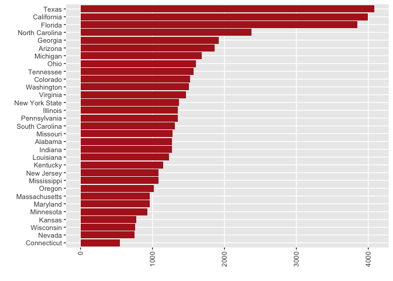

Data Cleaning and Analysis
================

## Required Packages

``` r
library(tidyverse)
```

    ## ── Attaching packages ─────────────────────────────────────── tidyverse 1.3.2 ──
    ## ✔ ggplot2 3.4.1      ✔ purrr   0.3.4 
    ## ✔ tibble  3.1.8      ✔ dplyr   1.0.10
    ## ✔ tidyr   1.2.1      ✔ stringr 1.4.1 
    ## ✔ readr   2.1.2      ✔ forcats 0.5.2 
    ## ── Conflicts ────────────────────────────────────────── tidyverse_conflicts() ──
    ## ✖ dplyr::filter() masks stats::filter()
    ## ✖ dplyr::lag()    masks stats::lag()

``` r
library(scico)
```

library(usmap) library(maps) library(socviz)

## Data Loading

### Retail Data

``` r
read_csv("/Users/kenjinchang/github/seasonality-of-us-meat-consumption/data/st_proc_mn_wtfix_abb.csv.gz") %>%
  select(-...1) %>%
  head(5)
```

    ## New names:
    ## Rows: 2796805 Columns: 11
    ## ── Column specification
    ## ──────────────────────────────────────────────────────── Delimiter: "," chr
    ## (3): state, concatenated, region dbl (7): ...1, yr, mn,
    ## conv_factor_to_units_kg, unit_price_kg, units_kg, re... date (1): date
    ## ℹ Use `spec()` to retrieve the full column specification for this data. ℹ
    ## Specify the column types or set `show_col_types = FALSE` to quiet this message.
    ## • `` -> `...1`

    ## # A tibble: 5 × 10
    ##   date          yr    mn state   conv_f…¹ unit_…² conca…³ units…⁴ region regio…⁵
    ##   <date>     <dbl> <dbl> <chr>      <dbl>   <dbl> <chr>     <dbl> <chr>    <dbl>
    ## 1 2017-01-28  2017     1 Alabama    0.340    5.65 PROCES…  15230. south     1.05
    ## 2 2017-02-25  2017     2 Alabama    0.340    5.90 PROCES…  12711. south     1.05
    ## 3 2017-03-25  2017     3 Alabama    0.340    5.83 PROCES…  13712. south     1.05
    ## 4 2017-04-22  2017     4 Alabama    0.340    5.74 PROCES…  14436. south     1.05
    ## 5 2017-05-20  2017     5 Alabama    0.340    5.63 PROCES…  14063. south     1.04
    ## # … with abbreviated variable names ¹​conv_factor_to_units_kg, ²​unit_price_kg,
    ## #   ³​concatenated, ⁴​units_kg, ⁵​region_dec2019dollars

### Agricultural Subsidy Data

``` r
read_csv("/Users/kenjinchang/github/seasonality-of-us-meat-consumption/data/county_data.csv") %>%
  head(5)
```

    ## Rows: 2305 Columns: 5
    ## ── Column specification ────────────────────────────────────────────────────────
    ## Delimiter: ","
    ## chr (3): county, state_abb, state
    ## dbl (2): total_subsidies_1995_2021, perc_state_total
    ## 
    ## ℹ Use `spec()` to retrieve the full column specification for this data.
    ## ℹ Specify the column types or set `show_col_types = FALSE` to quiet this message.

    ## # A tibble: 5 × 5
    ##   county                total_subsidies_1995_2021 perc_state_total state…¹ state
    ##   <chr>                                     <dbl>            <dbl> <chr>   <chr>
    ## 1 Gaines County, Texas                 1476802523            0.033 TX      Texas
    ## 2 Hale County, Texas                   1159637316            0.026 TX      Texas
    ## 3 Dawson County, Texas                 1110737641            0.025 TX      Texas
    ## 4 Terry County, Texas                   987748081            0.022 TX      Texas
    ## 5 Wharton County, Texas                 954867910            0.021 TX      Texas
    ## # … with abbreviated variable name ¹​state_abb

Shapefile Data

``` r
map_data("county") %>%
  head(6)
```

    ##        long      lat group order  region subregion
    ## 1 -86.50517 32.34920     1     1 alabama   autauga
    ## 2 -86.53382 32.35493     1     2 alabama   autauga
    ## 3 -86.54527 32.36639     1     3 alabama   autauga
    ## 4 -86.55673 32.37785     1     4 alabama   autauga
    ## 5 -86.57966 32.38357     1     5 alabama   autauga
    ## 6 -86.59111 32.37785     1     6 alabama   autauga

## Total Volume (kg) of Processed Meat Sales by State

``` r
read_csv("/Users/kenjinchang/github/seasonality-of-us-meat-consumption/data/st_proc_mn_wtfix_abb.csv.gz") %>%
  select(-...1) %>%
  group_by(state) %>%
  summarize(total_kg=sum(units_kg,na.rm=TRUE)) %>% 
  ggplot(aes(x=total_kg,y=reorder(state,total_kg))) + 
  geom_col() + 
  xlab("") + 
  ylab("") +
  theme(axis.text.x=element_text(angle=90,vjust=0.5,hjust=1),panel.grid.minor=element_blank())
```

    ## New names:
    ## Rows: 2796805 Columns: 11
    ## ── Column specification
    ## ──────────────────────────────────────────────────────── Delimiter: "," chr
    ## (3): state, concatenated, region dbl (7): ...1, yr, mn,
    ## conv_factor_to_units_kg, unit_price_kg, units_kg, re... date (1): date
    ## ℹ Use `spec()` to retrieve the full column specification for this data. ℹ
    ## Specify the column types or set `show_col_types = FALSE` to quiet this message.
    ## • `` -> `...1`

<!-- -->

## Mean Volume (kg) of Processed Meat Sales by State

``` r
read_csv("/Users/kenjinchang/github/seasonality-of-us-meat-consumption/data/st_proc_mn_wtfix_abb.csv.gz") %>%
  select(-...1) %>%
  group_by(state) %>%
  summarize(mean_kg=mean(units_kg,na.rm=TRUE)) %>% 
  ggplot(aes(x=mean_kg,y=reorder(state,mean_kg))) + 
  geom_col() + 
  xlab("") + 
  ylab("") +
  theme(axis.text.x=element_text(angle=90,vjust=0.5,hjust=1),panel.grid.minor=element_blank())
```

    ## New names:
    ## Rows: 2796805 Columns: 11
    ## ── Column specification
    ## ──────────────────────────────────────────────────────── Delimiter: "," chr
    ## (3): state, concatenated, region dbl (7): ...1, yr, mn,
    ## conv_factor_to_units_kg, unit_price_kg, units_kg, re... date (1): date
    ## ℹ Use `spec()` to retrieve the full column specification for this data. ℹ
    ## Specify the column types or set `show_col_types = FALSE` to quiet this message.
    ## • `` -> `...1`

<!-- -->

## Total Volume (kg) of Processed Meat Sales by Month

``` r
read_csv("/Users/kenjinchang/github/seasonality-of-us-meat-consumption/data/st_proc_mn_wtfix_abb.csv.gz") %>%
  select(-...1) %>%
  group_by(mn) %>%
  summarize(total_kg=sum(units_kg,na.rm=TRUE)) %>% 
  ggplot(aes(x=mn,y=total_kg)) + 
  geom_col() + 
  scale_x_continuous(breaks=c(1:12)) +
  xlab("") + 
  ylab("") +
  theme(panel.grid.minor=element_blank())
```

    ## New names:
    ## Rows: 2796805 Columns: 11
    ## ── Column specification
    ## ──────────────────────────────────────────────────────── Delimiter: "," chr
    ## (3): state, concatenated, region dbl (7): ...1, yr, mn,
    ## conv_factor_to_units_kg, unit_price_kg, units_kg, re... date (1): date
    ## ℹ Use `spec()` to retrieve the full column specification for this data. ℹ
    ## Specify the column types or set `show_col_types = FALSE` to quiet this message.
    ## • `` -> `...1`

<!-- -->

``` r
read_csv("/Users/kenjinchang/github/seasonality-of-us-meat-consumption/data/st_proc_mn_wtfix_abb.csv.gz") %>%
  select(-...1) %>%
  group_by(mn) %>%
  summarize(mean_kg=mean(units_kg,na.rm=TRUE)) %>% 
  ggplot(aes(x=mn,y=mean_kg)) + 
  geom_col() + 
  scale_x_continuous(breaks=c(1:12)) +
  xlab("") + 
  ylab("") +
  theme(panel.grid.minor=element_blank())
```

    ## New names:
    ## Rows: 2796805 Columns: 11
    ## ── Column specification
    ## ──────────────────────────────────────────────────────── Delimiter: "," chr
    ## (3): state, concatenated, region dbl (7): ...1, yr, mn,
    ## conv_factor_to_units_kg, unit_price_kg, units_kg, re... date (1): date
    ## ℹ Use `spec()` to retrieve the full column specification for this data. ℹ
    ## Specify the column types or set `show_col_types = FALSE` to quiet this message.
    ## • `` -> `...1`

<!-- -->

## State-Level Agricultural Subsidy Payments (using `usmap` package)

plot_usmap(regions=“counties”)

## State-Level Agricultural Subsidy Payments (using `maps` package)

``` r
us_counties <- map_data("county")
```

``` r
ggplot(us_counties,aes(x=long,y=lat,group=group,fill=subregion)) + 
  geom_polygon(color="gray90",linewidth=0.1) +
  coord_map(projection="albers",lat0=39,lat1=45) +
  guides(fill="none")+
  theme(axis.line=element_blank(),
        axis.text=element_blank(),
        axis.ticks=element_blank(),
        axis.title=element_blank(),
        panel.background=element_blank(),
        panel.border=element_blank(),
        panel.grid=element_blank())
```

<!-- -->

``` r
county_data <- read_csv("/Users/kenjinchang/github/seasonality-of-us-meat-consumption/data/county_data.csv") %>%
  mutate(county_no_state=gsub("(.*),.*","\\1",county)) %>%
  mutate(county_abb=str_remove_all(county_no_state, " County")) %>%
  mutate(state=tolower(state),county_abb=tolower(county_abb)) %>%
  unite(id,c("state","county_abb"),sep=", ",remove=FALSE) %>%
  select(id,total_subsidies_1995_2021,perc_state_total) %>%
  mutate(perc_natl_total=perc_state_total/sum(perc_state_total))
```

    ## Rows: 2305 Columns: 5
    ## ── Column specification ────────────────────────────────────────────────────────
    ## Delimiter: ","
    ## chr (3): county, state_abb, state
    ## dbl (2): total_subsidies_1995_2021, perc_state_total
    ## 
    ## ℹ Use `spec()` to retrieve the full column specification for this data.
    ## ℹ Specify the column types or set `show_col_types = FALSE` to quiet this message.

``` r
county_data %>%
  head(6)
```

    ## # A tibble: 6 × 4
    ##   id             total_subsidies_1995_2021 perc_state_total perc_natl_total
    ##   <chr>                              <dbl>            <dbl>           <dbl>
    ## 1 texas, gaines                 1476802523            0.033        0.00108 
    ## 2 texas, hale                   1159637316            0.026        0.000854
    ## 3 texas, dawson                 1110737641            0.025        0.000821
    ## 4 texas, terry                   987748081            0.022        0.000722
    ## 5 texas, wharton                 954867910            0.021        0.000689
    ## 6 texas, lamb                    928633397            0.021        0.000689

``` r
county_map <- map_data("county") %>%
  unite(id,c("region","subregion"),sep=", ",remove=FALSE)
county_map %>%
  head(6)
```

    ##        long      lat group order               id  region subregion
    ## 1 -86.50517 32.34920     1     1 alabama, autauga alabama   autauga
    ## 2 -86.53382 32.35493     1     2 alabama, autauga alabama   autauga
    ## 3 -86.54527 32.36639     1     3 alabama, autauga alabama   autauga
    ## 4 -86.55673 32.37785     1     4 alabama, autauga alabama   autauga
    ## 5 -86.57966 32.38357     1     5 alabama, autauga alabama   autauga
    ## 6 -86.59111 32.37785     1     6 alabama, autauga alabama   autauga

``` r
county_full <- left_join(county_map,county_data,by="id")
county_full %>%
  head(6)
```

    ##        long      lat group order               id  region subregion
    ## 1 -86.50517 32.34920     1     1 alabama, autauga alabama   autauga
    ## 2 -86.53382 32.35493     1     2 alabama, autauga alabama   autauga
    ## 3 -86.54527 32.36639     1     3 alabama, autauga alabama   autauga
    ## 4 -86.55673 32.37785     1     4 alabama, autauga alabama   autauga
    ## 5 -86.57966 32.38357     1     5 alabama, autauga alabama   autauga
    ## 6 -86.59111 32.37785     1     6 alabama, autauga alabama   autauga
    ##   total_subsidies_1995_2021 perc_state_total perc_natl_total
    ## 1                  61027557            0.012    0.0003939593
    ## 2                  61027557            0.012    0.0003939593
    ## 3                  61027557            0.012    0.0003939593
    ## 4                  61027557            0.012    0.0003939593
    ## 5                  61027557            0.012    0.0003939593
    ## 6                  61027557            0.012    0.0003939593

``` r
ggplot(county_full,aes(x=long,y=lat,fill=total_subsidies_1995_2021,group=group)) + 
  geom_polygon(color="white",linewidth=0.05) +
  coord_map(projection="albers",lat0=39,lat1=45) + 
  scale_fill_scico(palette="lajolla",na.value="white") +
  labs(fill="Total Agricultural SubsidiesGiven, 1995-2021") +
  xlab("") + 
  ylab("") +
  theme(legend.position="bottom",panel.grid=element_blank(),panel.background=element_blank(),axis.text=element_blank(),axis.ticks=element_blank())
```

<!-- -->

``` r
ggplot(county_full,aes(x=long,y=lat,fill=perc_natl_total,group=group)) + 
  geom_polygon(color="white",linewidth=0.05) +
  coord_map(projection="albers",lat0=39,lat1=45) + 
  scale_fill_scico(palette="lajolla",na.value="white") +
  labs(fill="Proportion of Agricultural Subsidies Given, 1995-2021") +
  xlab("") + 
  ylab("") +
  theme(legend.position="bottom",panel.grid=element_blank(),panel.background=element_blank(),axis.text=element_blank(),axis.ticks=element_blank())
```

<!-- -->
